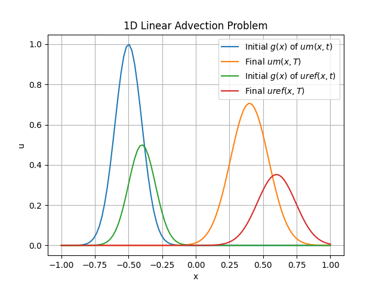

# REU-Advection-Simulation

### These programs simulate advection data in a one-dimensional case to predict the initial conditions via three approaches, the PINN, adjoint, and hybrid methods.

### To access the simulations, go into the InitialConditionPrediction folder and download requirements.txt and run Final_Adjoint_Advection.py, Final_Hybrid_Advection.py, and Final_PINN_Advection.py.

### To change the distribution of initial conditions, use a different g(x) to see how they perform on different advection scenarios

### Below is an example of initial conditions and final time-step measurements of measured & experimental data that is used in the adjoint method with the finite difference method to understand the underlying advection physics

